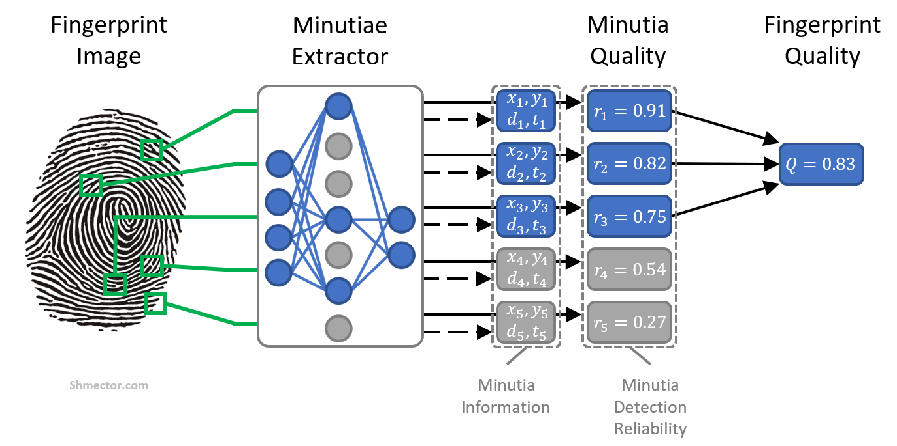
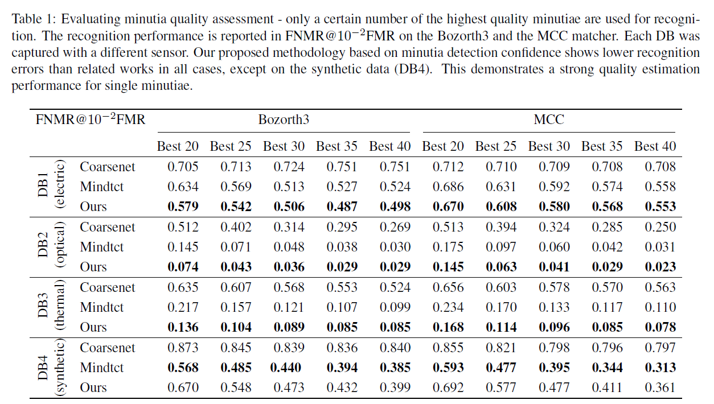
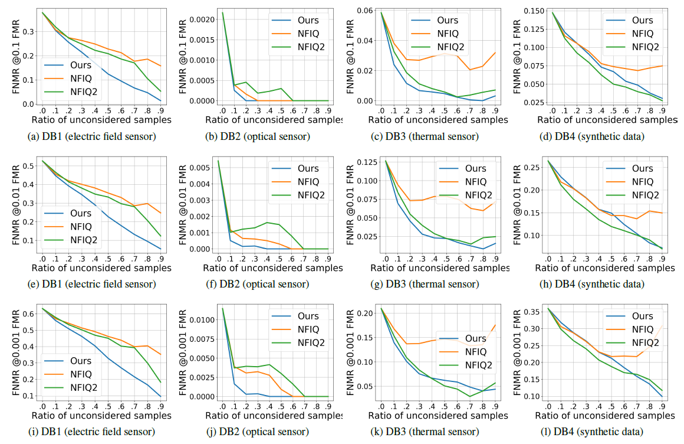

# Fingerprint Image Quality


## MiDeCon: Minutia Detection Confidence for Unsupervised and Accurate Minutia and Fingerprint Quality Assessment

The code for MiDeCon is currently cleaned and will be online end of June.

IEEE International Joint Conference on Biometrics (IJCB) 2021

* [Research Paper](https://arxiv.org/abs/2106.05601)
* [Implementation - MiDeCon on FineNet](to follow)


## Table of Contents 



- [Abstract](#abstract)
- [Key Points](#key-points)
- [Results](#results)
- [Requirements: Software](#requirements-software)
- [Installation](#installation)
- [Usage](#usage)
- [Citing](#citing)
- [Acknowledgement](#acknowledgement)
- [License](#license)

## Abstract


The most determinant factor to achieve high accuracies in fingerprint recognition systems is the quality of its samples. Previous works mainly proposed supervised solutions based on image properties that neglects the minutiae extraction process, despite that most fingerprint recognition techniques are based on this extracted information. Consequently, a fingerprint image might be assigned as high quality even if the utilized minutia extractor produces unreliable information for recognition. In this work, we propose a novel concept of assessing minutia and fingerprint quality based on minutia detection confidence (MiDeCon). MiDeCon can be applied to an arbitrary deep learning based minutia extractor and does not require quality labels for learning. Moreover, the training stage of MiDeCon can be completely avoided if a pre-trained minutiae extraction neural network is available. We propose using the detection reliability of the extracted minutia as its quality indicator. By combining the highest minutia qualities, MeDiCon accurately determines the quality of a full fingerprint. Experiments are done on the publicly available databases of the FVC 2006 and compared against NIST’s widely-used fingerprint image quality software NFIQ1 and NFIQ2. The results demonstrate a significantly stronger quality assessment performance of the proposed MiDeCon-qualities as related works on both, minutia- and fingerprint-level. 

## Key Points
In contrast to previous works, the proposed approach:

- **Does not require quality labels for training** - Previous works often rely on error-prone labelling mechanisms without a clear definition of quality. Our approach avoids the use of inaccurate quality labels by using the minutia detection confidence as a quality estimate. Moreover, the training state can be completely avoided if pre-trained minutiae extraction neural network trained with dropout is available. 

- **Considers difficulties in the minutiae extraction** - Previous works estimates the quality of a fingerprint based on the properties of the image neglecting the minutiae extraction process. However, the extraction process might face difficulties that are not considered in the image properties and thus, produce unreliable minutia information. Our solution defines quality through the prediction confidence of the extractor and thus, considers this problem. 

- **Produces continuous quality values** - While previous works often categorize the quality outputs in discrete categories (e.g. {good, bad, ugly}; {1,2,3,4,5}),, our approach produces continuous quality values that allow more fine-grained and flexible enrolment and matching processes. 

- **Includes quality assessment of single minutiae** - Unlike previous works, our solution assesses the quality of full fingerprints as well as the quality of single minutiae. This is specifically useful in forensic scenarios where forensic examiners aim to find reliable minutiae suitable for identification.

For more details, please take a look at the paper.

## Results

### Quality Assessment of Single Minutiae

Evaluating minutia quality assessment - only a certain number of the highest quality minutiae are used for recognition.
The recognition performance is reported in FNMR@FMR on the Bozorth3 and the MCC matcher. Each DB was captured with a different sensor. Our proposed methodology based on minutia detection confidence shows lower recognition errors than related works in all cases, except on the synthetic data (DB4). This demonstrates a strong quality estimation performance for single minutiae.

 


### Quality Assessment of Full Fingerprints

Fingerprint quality assessment on the MCC matcher. Each row represents the recognition error at a different FMR
(, , and ). Especially on the real-world sensor data, the proposed approach outperforms the widely-used NFIQ and NFIQ2 baselines. This holds true for all investigated sensor-types.

 


## Requirements: Software
``` Python 2.7```, ```Tensorflow 1.7.0```, ```Keras 2.1.6```.

## Installation
We recommend Anaconda to install the required packages.
```shell
conda install cv2, numpy, scipy, matplotlib, pydot, graphviz
```

After the required packages have been installed, MiDeCon can be run on the provided test sample.

## Usage

The files to run MiDeCon are located in **MiDeCon/FineNet/**.
1. Run ``` FineNet_prediction.py``` to predict on the sample.
2. Run ``` evaluate_predictions.py``` to generate the quality scores.
3. Run ``` quality_assessment_on_fingerprint.py``` to generate a list of fingerprint quality scores with the corresponding fingerprint labels.
4. Run ``` quality_assessment_on_minutiae.py``` to generate a template related to the fingerprint containing the minutiae quality scores.

The default output directory is **Data/**.


**The locations of the provided models:**
- The original pretrained MinutiaeNet-models: **MiDeCon/Models/**.
- The pretrained MiDeCon(FineNet)-model: **MiDeCon/output_FineNet/FineNet_dropout/**.

## Citing

If you use this code, please cite the following paper.


```
@misc{terhoerst2021midecon,
      title={{MiDeCon}: Unsupervised and Accurate Fingerprint and Minutia Quality Assessment based on Minutia Detection Confidence}, 
      author={Philipp Terh{\"{o}}rst and Andre Boller and Naser Damer and Florian Kirchbuchner and Arjan Kuijper},
      year={2021},
      eprint={2106.05601},
      archivePrefix={arXiv},
      primaryClass={cs.CV}
}
```

If you make use of our MiDeCon implementation based on FineNet, please additionally cite the original .

## Acknowledgement

This research work has been funded by the German Federal Ministry of Education and Research and the Hessen State Ministry for Higher Education, Research and the Arts within their joint support of the National Research Center for Applied Cybersecurity ATHENE. 

## License 

This project is licensed under the terms of the Attribution-NonCommercial-ShareAlike 4.0 International (CC BY-NC-SA 4.0) license.
Copyright (c) 2021 Fraunhofer Institute for Computer Graphics Research IGD Darmstadt
